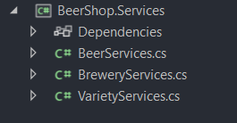
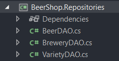

# Full Stack Stappenplan :computer:

Dit is een stappenplan dat je kan volgen voor de examen. Als je fouten ziet gelieve deze te melden.

## 1. Nieuw project aanmaken

1.  Open VS en selecteer `Create a new project`.

2.  Selecteer `ASP.NET Core Web App (Model-View-Controller)`.

    

    >[!CAUTION]
    > Zorg zerker dat het C# en MVC is.

3.  Vul de projectnaam, locatie in en druk op Next.

4.  Kies voor de juiste framework `.NET 7.0` en authentiecatietype `Invidual accounts`.

    

    >[!CAUTION]
    > Het zou kunnen dat op het examen extra dingen gevraagd kunnen worden. Dus kijk goed naar de opgave!

5.  Druk op `Create` om het project te creëren. 

## 2. App architecture opzetten

### A.d.h.v. script

Gebruik deze script om de domains, services en repositories projectmappen aan te maken en ze te toevoegen aan je solution. Het zorgt ook voor de nodige references tuss. de projecten.

1.  Selecteer links boven de optie `View`.

    

2.  Selecteer de optie `Terminal`

    

3.  Onderaan moet je nu een Powershell terminal zien.

    

4. Plak hier de onderstaande code in.

    ```powershell
    # Als je solution naam anders is dan je folder naam,
    # Verander dan $dirName naar de naam van je solution,
    # dus $dirName = "MijnProjectNaam"

    # Variabelen
    $dirName = (Get-Item -Path ".\").Name
    $domainsName = $dirName + ".Domains"
    $servicesName = $dirName + ".Services"
    $reposName = $dirName + ".Repositories"

    # Niewe class libraries toevoegen met de juiste projectnamen
    dotnet new classlib --name $domainsName
    dotnet new classlib --name $servicesName
    dotnet new classlib --name $reposName

    # De niewe libraries toevoegen aan project sln
    dotnet sln add $domainsName
    dotnet sln add $servicesName
    dotnet sln add $reposName

    # De juiste references leggen tussen de projecten
    dotnet add $dirName reference $domainsName
    dotnet add $dirName reference $servicesName
    dotnet add $servicesName reference $domainsName
    dotnet add $servicesName reference $reposName
    dotnet add $reposName reference $domainsName

    # Remove the class1 classes from the class libraries
    Remove-Item -Path "$domainsName\class1.cs" -Force
    Remove-Item -Path "$servicesName\class1.cs" -Force
    Remove-Item -Path "$reposName\class1.cs" -Force

    # Dit hoeft erbij
    Write-Host "Done"
    ```

5.  Hier zie je dan het resultaat:

    

### Manueel

## 3. Entity Framework en AutoMapper packages opzetten (voor database)

### Packages installeren a.d.h.v. script

Om de packages toe te voegen aan je projecten, kan je de volgende script gebruiken

Plak dit in je Powershell terminal (zie 2. voor terminal tutorial)

```Powershell
# Variabelen

$dirName = (Get-Item -Path ".\").Name
$domainsName = $dirName + ".Domains"
$servicesName = $dirName + ".Services"
$reposName = $dirName + ".Repositories"
$packageVersion = "7.0.11"
$mapperDir = $dirname + "\AutoMapper"

# SqlServer voor de domains en repos
dotnet add $domainsName package Microsoft.EntityFrameworkCore.SqlServer --version $packageVersion
dotnet add $reposName package Microsoft.EntityFrameworkCore.SqlServer --version $packageVersion

# Tools voor de domains en repos
dotnet add $domainsName package Microsoft.EntityFrameworkCore.Tools --version $packageVersion
dotnet add $reposName package Microsoft.EntityFrameworkCore.Tools --version $packageVersion

# Design voor de domains en views
dotnet add $domainsName package Microsoft.EntityFrameworkCore.Design --version $packageVersion
dotnet add $dirName package Microsoft.EntityFrameworkCore.Design --version $packageVersion

# AutoMapper voor de views
dotnet add $dirName package AutoMapper.Extensions.Microsoft.DependencyInjection

# Onnodige packages removen in views
dotnet remove $dirName package Microsoft.EntityFrameworkCore.SqlServer
dotnet remove $dirName package Microsoft.EntityFrameworkCore.Tools

# Toevoegen van AutoMapper map en class
dotnet new cs --name AutoMapperProfile --output $mapperDir

# Dit hoeft erbij
Write-Host "Done"
```
Het configureren van de AutoMapper gebeurt later.

## 4. Database opzetten

Op het examen zal je hoogstwaarschijnlijk een bestaande database (backup) moeten restoren vooraleer je het zal kunnen gebruiken.

### Bestaande database toevoegen aan SQL Management Studio

Voordat je begint, zorg eerst dat je SQL service aanstaat.

1.  Open de `Services` app in Windows.
2.  Start jouw `SQL Server (SQL19_VIVES)` server op. (naam kan anders zijn).

Nu kan je verder met het toevoegen van de database

1.  Kopieer het `database.bak` bestand naar `C:\Program Files\Microsoft SQL Server\MSSQL16.SQL19_VIVES\MSSQL\Backup` (servernaam kan anders zijn)

2.  Open de `Microsoft SQL Server Management Studio` app in Windows.
3.  Meldt aan.
4.  Rechterklik op `Databases` en selecteer `Restore Database`
5.  Bij Source kies voor `Device` en druk op de `...` om een file te kiezen
6.  Druk op `Add`
7.  Kies uw `database.bak` file
8.  Druk 2x op `OK`

### Connectie met DB vastleggen in VS

1.  Druk linksboven op `View`
2.  Selecteer `Server Explorer`
3.  Rechterklik op `Data Connections` en kies voor `Add Connection...`
4.  Selecteer uw servernaam en databasenaam
> Soms kan dit een error teruggevern. In mij geval krijg ik altijd een error. Dus moet ik in mijn geval `.\sql19_vives` als servernaam gebruiken.

### Scaffold command toepassen

1.  Druk bovenaan op `Tools`
2.  Selecteer `NuGet Package Manager` en dan `Package Manager Console`
3. Zorg dat de `Default project` ingesteld staat op `[PROJECTNAAM].Domains`
4.  Plak het command
>[!CAUTION]
>   Vergeet niet de waarden te veranderen!
```Powershell
Scaffold-DbContext -Connection "Server=.\SERVERNAAM; Database=DATABASENAAM; Trusted_Connection=True; TrustServerCertificate=True; MultipleActiveResultSets=true;" -Provider Microsoft.EntityFrameworkCore.SqlServer -OutputDir "Entities" -ContextDir "Data" -Context "TABELDbContext"
```

Voorbeeld

```Powershell
Scaffold-DbContext -Connection "Server=.\SQL19_VIVES; Database=DB-Beer; Trusted_Connection=True; TrustServerCertificate=True; MultipleActiveResultSets=true;" -Provider Microsoft.EntityFrameworkCore.SqlServer -OutputDir "Entities" -ContextDir "Data" -Context "BeerDbContext"
```

## 5. AutoMapper Configureren
>[!CAUTION]
>Het installeren van de AutoMapper packages werd al gebeurt in de script. (zie 3.) Als je het script niet hebt gevolgd: NuGet package manager -> AutoMapper.Extensions.Microsoft.DependencyInjection -> enkel voor domains installeren (versie maakt niet uit. Mag laatste zijn.)

1.  Voeg AutoMapper toe aan je `Program.cs` bestand
    ```C#
    // Add Automapper
    builder.Services.AddAutoMapper(typeof(Program));

    // De automapper moet boven dit deel
    // DIT ONDERSTE DEEL NIET KOPIEREN!
    // HET BESTAAT AL
    var app = builder.Build();
    ```
2.  Ga naar `AutoMapper\AutoMapperProfile.cs`
3.  Voeg dit code toe:

    ```C#
    public class AutoMapperProfile : Profile
    {
        public AutoMapperProfile()
        {
            CreateMap<Beer, BeerVM>();
            //CreateMap<TSource, TDestination>;
        }
    }
        ```
