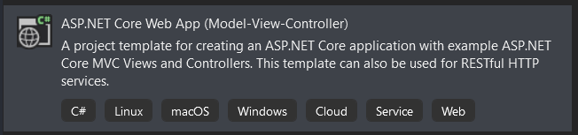
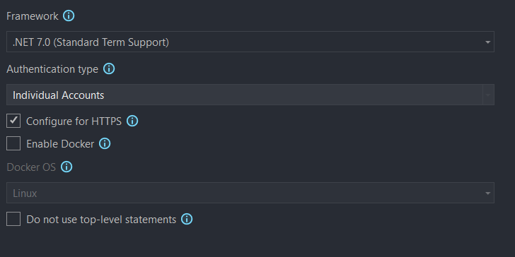
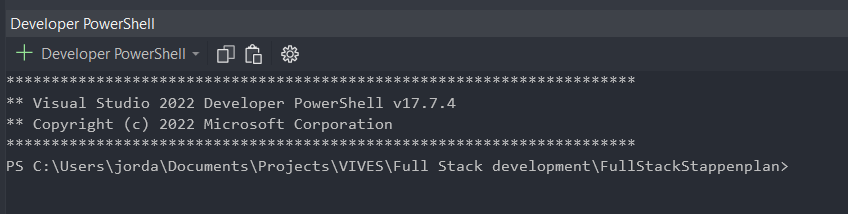
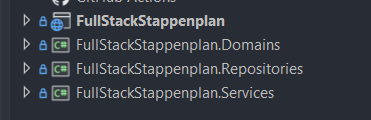
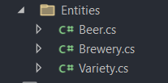
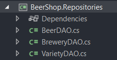

# Full Stack Stappenplan :computer:

Dit is een stappenplan dat je kan volgen voor de examen. Als je fouten ziet gelieve deze te melden.

## 1. Nieuw project aanmaken

1.  Open VS en selecteer `Create a new project`.

2.  Selecteer `ASP.NET Core Web App (Model-View-Controller)`.

    

>[!CAUTION]
> Zorg zerker dat het C# en MVC is.

3.  Vul de projectnaam, locatie in en druk op Next.

4.  Kies voor de juiste framework `.NET 7.0` en authentiecatietype `Invidual accounts`.

    

>[!CAUTION]
> Het zou kunnen dat op het examen extra dingen gevraagd kunnen worden. Dus kijk goed naar de opgave!

5.  Druk op `Create` om het project te creëren. 

## 2. App architecture opzetten

### A.d.h.v. script

Gebruik deze script om de domains, services en repositories projectmappen aan te maken en ze te toevoegen aan je solution. Het zorgt ook voor de nodige references tuss. de projecten.

1.  Selecteer links boven de optie `View`.

    

2.  Selecteer de optie `Terminal`

    

3.  Onderaan moet je nu een Powershell terminal zien.

    

4. Plak hier de onderstaande code in.

>[!IMPORTANT]
> Als je solution naam anders is dan je folder naam, verander dan $dirName naar de naam van je solution. Dus $dirName = "MijnProjectNaam"

    ```powershell

    #SCRIPT

    # Als je solution naam anders is dan je folder naam,
    # Verander dan $dirName naar de naam van je solution,
    # dus $dirName = "MijnProjectNaam"

    # Variabelen
    $dirName = (Get-Item -Path ".\").Name
    $domainsName = $dirName + ".Domains"
    $servicesName = $dirName + ".Services"
    $reposName = $dirName + ".Repositories"
    $frameworkVersion = "net7.0"

    # Niewe class libraries toevoegen met de juiste projectnamen
    dotnet new classlib --name $domainsName --framework $frameworkVersion
    dotnet new classlib --name $servicesName --framework $frameworkVersion
    dotnet new classlib --name $reposName --framework $frameworkVersion

    # De niewe libraries toevoegen aan project sln
    dotnet sln add $domainsName
    dotnet sln add $servicesName
    dotnet sln add $reposName

    # De juiste references leggen tussen de projecten
    dotnet add $dirName reference $domainsName
    dotnet add $dirName reference $servicesName
    dotnet add $servicesName reference $domainsName
    dotnet add $servicesName reference $reposName
    dotnet add $reposName reference $domainsName

    # Remove the class1 classes from the class libraries
    Remove-Item -Path "$domainsName\class1.cs" -Force
    Remove-Item -Path "$servicesName\class1.cs" -Force
    Remove-Item -Path "$reposName\class1.cs" -Force

    # Dit hoeft erbij
    Write-Host "Done"
    ```

5.  Hier zie je dan het resultaat:

    

## 3. Entity Framework en AutoMapper packages opzetten (voor database)

### Packages installeren a.d.h.v. script

Om de packages toe te voegen aan je projecten, kan je de volgende script gebruiken

Plak dit in je Powershell terminal (zie 2. voor terminal tutorial)

```Powershell

#SCRIPT

# Variabelen

$dirName = (Get-Item -Path ".\").Name
$domainsName = $dirName + ".Domains"
$servicesName = $dirName + ".Services"
$reposName = $dirName + ".Repositories"
$packageVersion = "7.0.11"
$mapperDir = $dirname + "\AutoMapper"

# SqlServer voor de domains en repos
dotnet add $domainsName package Microsoft.EntityFrameworkCore.SqlServer --version $packageVersion
dotnet add $reposName package Microsoft.EntityFrameworkCore.SqlServer --version $packageVersion

# Tools voor de domains en repos
dotnet add $domainsName package Microsoft.EntityFrameworkCore.Tools --version $packageVersion
dotnet add $reposName package Microsoft.EntityFrameworkCore.Tools --version $packageVersion

# Design voor de domains en views
dotnet add $domainsName package Microsoft.EntityFrameworkCore.Design --version $packageVersion
dotnet add $dirName package Microsoft.EntityFrameworkCore.Design --version $packageVersion

# AutoMapper voor de views en directory
dotnet add $dirName package AutoMapper.Extensions.Microsoft.DependencyInjection

# Onnodige packages removen in views
dotnet remove $dirName package Microsoft.EntityFrameworkCore.SqlServer
dotnet remove $dirName package Microsoft.EntityFrameworkCore.Tools

# Toevoegen van AutoMapper map en class
dotnet new class --name AutoMapperProfile --output $mapperDir

# Dit hoeft erbij
Write-Host "Done"
```
Het configureren van de AutoMapper gebeurt later.

## 4. Database opzetten

Op het examen zal je hoogstwaarschijnlijk een bestaande database (backup) moeten restoren vooraleer je het zal kunnen gebruiken.

### Bestaande database toevoegen aan SQL Management Studio

Voordat je begint, zorg eerst dat je SQL service aanstaat.

1.  Open de `Services` app in Windows.
2.  Start jouw `SQL Server (SQL19_VIVES)` server op. (naam kan anders zijn).

Nu kan je verder met het toevoegen van de database

1.  Kopieer het `database.bak` bestand naar `C:\Program Files\Microsoft SQL Server\MSSQL16.SQL19_VIVES\MSSQL\Backup` (servernaam kan anders zijn)

2.  Open de `Microsoft SQL Server Management Studio` app in Windows.
3.  Meldt aan.
4.  Rechterklik op `Databases` en selecteer `Restore Database`
5.  Bij Source kies voor `Device` en druk op de `...` om een file te kiezen
6.  Druk op `Add`
7.  Kies uw `database.bak` file
8.  Druk 2x op `OK`

### Connectie met DB vastleggen in VS

1.  Druk linksboven op `View`
2.  Selecteer `Server Explorer`
3.  Rechterklik op `Data Connections` en kies voor `Add Connection...`
4.  Selecteer uw servernaam en databasenaam

>[!IMPORTANT]
> Soms kan dit een error teruggevern. In mij geval krijg ik altijd een error. Dus moet ik in mijn geval `.\sql19_vives` als servernaam gebruiken.

### Scaffold command toepassen (Domain Layer opmaken)

1.  Druk bovenaan op `Tools`
2.  Selecteer `NuGet Package Manager` en dan `Package Manager Console`
3. Zorg dat de `Default project` ingesteld staat op `[PROJECTNAAM].Domains`
4.  Plak het commando

>[!CAUTION]
>   Vergeet niet de waarden te veranderen en zorg dat je in de juiste project terminal zet (Stap 3. NIET VERGETEN)!

```Powershell
Scaffold-DbContext -Connection "Server=.\SERVERNAAM; Database=DATABASENAAM; Trusted_Connection=True; TrustServerCertificate=True; MultipleActiveResultSets=true;" -Provider Microsoft.EntityFrameworkCore.SqlServer -OutputDir "Entities" -ContextDir "Data" -Context "TABELDbContext"
```

Voorbeeld

```Powershell
Scaffold-DbContext -Connection "Server=.\SQL19_VIVES; Database=DB-Beer; Trusted_Connection=True; TrustServerCertificate=True; MultipleActiveResultSets=true;" -Provider Microsoft.EntityFrameworkCore.SqlServer -OutputDir "Entities" -ContextDir "Data" -Context "BeerDbContext"
```

>[!WARNING]
>Als je error krijgt dat "Scaffold-DbContext" geen geldige commando is moet je Visual Studio opnieuw opstarten.

## 5. Repository Layer opmaken

Deze laag zorgt voor alle call naar de database.

1.  Maak voor elke `entity` dat je in je Domain layer hebt, een `DAO` klasse in je repositories

     
    
    

    script:

>[!CAUTION]
> Zorg wel eerst dat je entities gemaakt zijn!

    ```Powershell

    #SCRIPT

    # Variabelen
    $dirName = (Get-Item -Path ".\").Name
    $domainsDir = $dirName + ".Domains"
    $reposDir = $dirName + ".Repositories"
    $entityDir = $domainsDir + "\Entities"
    $entities = Get-ChildItem -Path $entityDir 
    echo $entities

    # Klassen toevoegen adhv entities
    foreach($entity in $entities) {
        $dao = $entity.BaseName + "DAO"
        dotnet new class --name $dao --output $reposDir
    }

    # Done
    Write-Host "Done"
    ```

2.  Per DAO klasse wil een constructor maken en get/edit/delete methoden maken

>[!WARNING]
> Voeg enkel de methoden die worden gevraagd op de examen. Dit is een oplijsting van alle methoden die je kan doen.


    Bv: `BeerDAO`
    ```c#

    public class BeerDAO
    {
        // BeerDbContext van domain layer
        private readonly BeerDbContext _dbContext;

        // Constructor
        public BeerDAO()
        {
            _dbContext = new BeerDbContext();
        }

        // Alle bieren opvragen.
        public async Task<IEnumerable<Beer>?> GetAll()
        {
            try
            {
                return await _dbContext.Beers
                    .Include(a => a.BrouwernrNavigation)
                    .Include(b => b.SoortnrNavigation)
                    .ToListAsync(); 
            }
            catch (Exception ex)
            {
                Console.WriteLine("error in DAO");
                throw;
            }
        }

        // Alle bieren opvragen (enkel hun naam)
        public async Task<IEnumerable<String>?> GetAllNames()
        {
            try
            {
                return await _dbContext.Beers.Select(b => b.Naam).ToListAsync();
            }
            catch (Exception ex)
            {
                Console.WriteLine("error in DAO");
                throw;
            }
        }

        // Lijst van bieren opvragen adhv hun Brouwerijnaam
        // Dus een lijst opvragen adhv parameter
        public async Task<IEnumerable<Beer>?> GetBeerByBreweryName(String? breweryName)
        {
            try
            {// select * from Bieren
                return await _dbContext.Beers
                    .Where(b => b.BrouwernrNavigation.Naam == breweryName)
                    .Include(b => b.BrouwernrNavigation)
                    .Include(b => b.SoortnrNavigation)
                    .ToListAsync();
            }
            catch (Exception ex)
            {
                Console.WriteLine("error in DAO");
                throw;
            }
        }

        // Één bier opvragen adhv id
        public async Task<Beer> Get(int id)
        {
            try
            {
                return await _dbContext.Beers.Where
                    (b => b.Biernr == id)
                    .Include(b => b.BrouwernrNavigation)
                    .Include(b => b.SoortnrNavigation).FirstAsync();
            }
            catch(Exception ex)
            {
                throw new Exception("error DAO beer");
            }
        }

        //An entity may be in one of the following states:

        // Added.The entity does not yet exist in the database. The SaveChanges method must issue an INSERT statement.
        
        // Unchanged.Nothing needs to be done with this entity by the SaveChanges method.When you read an entity from the database, the entity starts out with this status.

        // Modified.Some or all of the entity's property values have been modified. The SaveChanges method must issue an UPDATE statement.

        // Deleted.The entity has been marked for deletion.The SaveChanges method must issue a DELETE statement.

        // Detached.The entity isn't being tracked by the database context.

        //  Een bier toevoegen
        public async Task Add(Beer entity)
        {
            _dbContext.Entry(entity).State = EntityState.Added;
            try
            {
                await _dbContext.SaveChangesAsync();
            }
            catch(Exception ex)
            {
                Console.WriteLine(ex);
                throw;
            }
        }

        // Een bier aanpassen
        public async Task Edit(Beer entity)
        {
            _dbContext.Entry(entity).State = EntityState.Modified;
            try
            {
                await _dbContext.SaveChangesAsync();
            }
            catch (Exception ex)
            {
                Console.WriteLine(ex);
                throw;
            }
        }

        // Een bier verwijderen
        public async Task Delete(Beer entity)
        {
            _dbContext.Entry(entity).State = EntityState.Deleted;
            try
            {
                await _dbContext.SaveChangesAsync();
            }
            catch (Exception ex)
            {
                Console.WriteLine(ex);
                throw;
            }
        }
    }
    ```

    
## 6. Service Layer opmaken

Dit is het `tussenlaag` die data van je `Repositories` naar je `controller` stuurt (Repositories (`DAO`) -> Services (`service`) -> Controller)

1.  Maak voor elke `DAO` in je Repositories, een nieuwe `Service` klasse
    
    

    Script:

    ```Powershell

    #SCRIPT

    # Variabelen
    $dirName = (Get-Item -Path ".\").Name
    $domainsDir = $dirName + ".Domains"
    $servicesDir = $dirName + ".Services"
    $entityDir = $domainsDir + "\Entities"
    $entities = Get-ChildItem -Path $entityDir 
    echo $entities

    # Klassen toevoegen adhv entities
    foreach($entity in $entities) {
        $service = $entity.BaseName + "Service"
        dotnet new class --name $service --output $servicesDir
    }

    # Done
    Write-Host "Done"
    ```

2.  Per `Service` klasse will de respectievelijke methoden 'kopieren'.

    Bv. `BeerService`

    ```c#
    public class BeerServices
    {
        private BeerDAO _beerDAO;
        public BeerServices()
        {
            _beerDAO = new BeerDAO();
        }

        public async Task<IEnumerable<Beer>?> GetAll()
        {
            return await _beerDAO.GetAll();
        }

        public async Task<IEnumerable<Beer>?> GetByAlcohol(decimal alcohol)
        {
            return await _beerDAO.GetByAlcohol(alcohol);
        }
        public async Task<IEnumerable<Beer>?> GetBeerByBrewery(int? breweryId)
        {
            return await _beerDAO.GetBeerByBrewery(breweryId);
        }
        public async Task<IEnumerable<Beer>?> GetBeerByBreweryName(String? breweryName)
        {
            return await _beerDAO.GetBeerByBreweryName(breweryName);
        }

        public async Task<Beer> Get(int id)
        {
            return await _beerDAO.Get(id);
        }
        public async Task Add(Beer entity)
        {
            await _beerDAO.Add(entity);
        }

        public async Task Edit(Beer entity)
        {
            await _beerDAO.Edit(entity);
        }
    }
    ```


## 7. AutoMapper Configureren
>[!CAUTION]
>Het installeren van de AutoMapper packages werd al gebeurt in de script. (zie 3.) Als je het script niet hebt gevolgd: NuGet package manager -> AutoMapper.Extensions.Microsoft.DependencyInjection -> enkel voor domains installeren (versie maakt niet uit. Mag laatste zijn.)

1.  Voeg AutoMapper toe aan je `Program.cs` bestand
    ```C#
    // Add Automapper
    builder.Services.AddAutoMapper(typeof(Program));

    // De automapper moet boven dit deel
    // DIT ONDERSTE DEEL NIET KOPIEREN!
    // HET BESTAAT AL
    var app = builder.Build();
    ```
2.  Ga naar `AutoMapper\AutoMapperProfile.cs`
3.  Voeg dit code toe:

    ```C#
    public class AutoMapperProfile : Profile
    {
        public AutoMapperProfile()
        {
            //CreateMap<Beer, BeerVM>();
            //CreateMap<TSource, TDestination>;
        }
    }
    ```
## 8. Aparte oefeningen

### Rich Control Panel
1.  Rechterklik op de `wwwroot` folder en selecteer `Add`
2.  Klik op `Client-Side Library`
3.  Provider: `cdnjs`
4.  Library: Typ `tinymce` in en druk op tab om de laatste versie te selecteren.
5.  Druk op `install`
6.  Voeg onderaan in de `view` waardat je de panel wilt weergeven het volgende:

    ```cs
    @section Scripts {
    @{
        await Html.RenderPartialAsync("_ValidationScriptsPartial");
    }
    ```
    ```html
    <script src="~/lib/tinymce/tinymce.min.js"></script>

    <script>
        tinymce.init({
            selector: '#tinyarea',
            plugins: 'ai tinycomments mentions anchor autolink charmap codesample emoticons image link lists media searchreplace table visualblocks wordcount checklist mediaembed casechange export formatpainter pageembed permanentpen footnotes advtemplate advtable advcode editimage tableofcontents mergetags powerpaste tinymcespellchecker autocorrect a11ychecker typography inlinecss',
            toolbar: 'undo redo | blocks fontfamily fontsize | bold italic underline strikethrough | link image media table mergetags | align lineheight | tinycomments | checklist numlist bullist indent outdent | emoticons charmap | removeformat',
            tinycomments_mode: 'embedded',
            tinycomments_author: 'Author name',
            mergetags_list: [
                { value: 'First.Name', title: 'First Name' },
                { value: 'Email', title: 'Email' },
            ],
            ai_request: (request, respondWith) => respondWith.string(() => Promise.reject("See docs to implement AI Assistant")),
        });
    </script>
    ```

7.  Geef het gekozen selector id (zie selector in tinymce.init) aan je textarea mee.
    ```html
    <textarea asp-for="Description" class="form-control" id="tinyarea"></textarea>
    ```

>[!CAUTION]
>Vergeet niet om je `RenderSectionAsync` aan je layout html toe te voegen!

8.  Voeg `RenderSectionAsync` aan je layout html toe (Shared\Layout.cshtml)
>[!IMPORTANT]
>Dit moet boven de sluitings tag van je body.

    ```html
    ...
    <script src="~/lib/jquery/dist/jquery.min.js"></script>
    <script src="~/lib/bootstrap/dist/js/bootstrap.bundle.min.js"></script>
    <script src="~/js/site.js" asp-append-version="true"></script>
    @await RenderSectionAsync("Scripts", required: false)
    </body>
    ```

### jQuery DatePicker

Dit voorbeeld heeft 2 inputs nl. vertrekdatum en aankomstdatum

1.  Rechterklik op de `wwwroot` folder en selecteer `Add`
2.  Klik op `Client-Side Library`
3.  Provider: `cdnjs`
4.  Library: Typ `jqueryui` in en druk op tab om de laatste versie te selecteren.
5.  Selecteer `Choose specific files`
6.  Selecteer `jquery-ui.min.js` en onder `themes\[Kies thema]\` kies `jquery-ui.min.css`
7.  Druk op `install`
8.  Voeg onderaan in de `view` waardat je de panel wilt weergeven het volgende:

    ```cs
    @section Scripts {
    @{
        await Html.RenderPartialAsync("_ValidationScriptsPartial");
    }
    ```
    ```html
    <script src="~/lib/jqueryui/jquery-ui.min.js"></script>

    <script>
        $(() => {
            let mindate;
            $("#StartDate").datepicker({
                beforeShowDay: $.datepicker.noWeekends,
                minDate: 0,
                numberOfMonths: 3,
                dateFormat: 'yy-mm-dd',
                onSelect: (minDateStr) => {

                    mindate = minDateStr; // Get selected date
                    console.log(mindate);
                    $("#EndDate").datepicker('option', 'minDate', minDateStr || '0');// Set other min, default to today // don't use $("#dateBack").datepicker({ minDate: min || '0' }); only for  initialization
                }
            });

            $("#EndDate").datepicker({
                minDate: 0,
                maxDate: '+1Y+6M',
                dateFormat: 'yy-mm-dd',
                onSelect: (maxDateStr) => {
                    if (maxDateStr !== null) {
                        console.log(maxDateStr);
                        let start = new Date(mindate);
                        let end = new Date(maxDateStr);
                        let days = (end - start)
                            / (1000 * 60 * 60 * 24);
                        console.log("verschil :", days);
                        $("#DateResult").val(days);
                    }
                }
            });
        })
    </script>
    ```

9.  Dit zijn de input velden voor deze situatie:
    ```html
    <div class="form-group">
        <label asp-for="StartDate" class="control-label"></label>
        <input asp-for="StartDate" class="form-control" />
        <span asp-validation-for="StartDate" class="text-danger"></span>
    </div>
    <div class="form-group">
        <label asp-for="EndDate" class="control-label"></label>
        <input asp-for="EndDate" class="form-control" />
        <span asp-validation-for="EndDate" class="text-danger"></span>
    </div>
    ```

    ```html
    <input type="text" id="DateResult" />
    ```

>[!CAUTION]
>Vergeet niet om je `RenderSectionAsync` aan je layout html toe te voegen!
10.  Voeg `RenderSectionAsync` aan je layout html toe (Shared\Layout.cshtml)
>[!IMPORTANT]
>Dit moet boven de sluitings tag van je body.

```html
<script src="~/lib/jquery/dist/jquery.min.js"></script>
<script src="~/lib/bootstrap/dist/js/bootstrap.bundle.min.js"></script>
<script src="~/js/site.js" asp-append-version="true"></script>
@await RenderSectionAsync("Scripts", required: false)
</body>
```